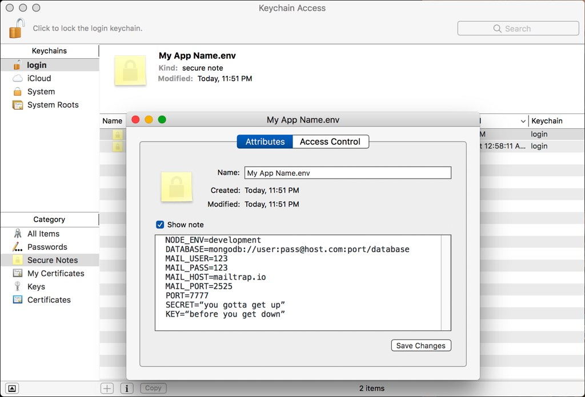

# keychain-env
Set node process environment variables based on a secure note stored in the OS X keychain.

The contents of the note, or your template file, must be in the format expected
by the [`dotenv`](https://github.com/motdotla/dotenv) package.

## Example
```javascript
const { setEnvFromNote } = require('keychain-env');
const path = require('path');

const options = {
  //  Ounce of prevention, pound of cure and all that.
  timeout: 3000,

  //  If this is our first time runnig and there is no note in
  //  the keychain yet then read a file from disk full of placeholder
  //  values and write that to the keychain so we know what values
  //  need to be filled in.
  templatePath: path.resolve(__dirName, 'variables.env.template')
}

setEnvFromNote('My App Name.env', options);
```


